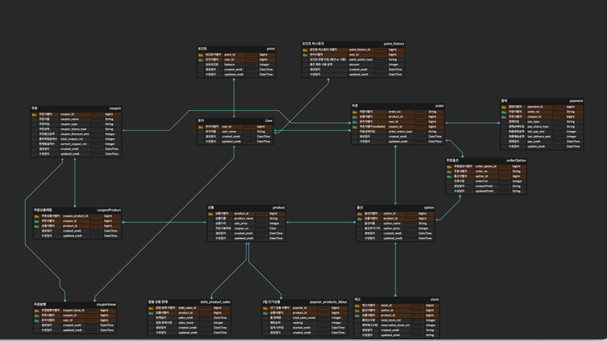
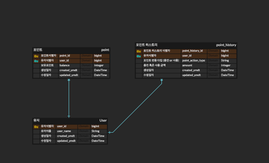
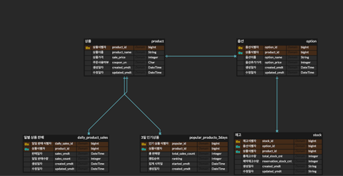
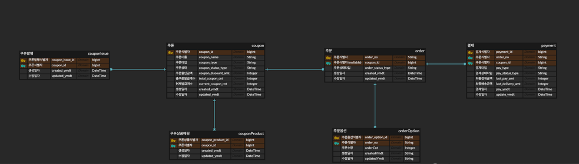

## 전체 도메인 ERD



### 회원/포인트 도메인 ERD
- 회원(User)과 포인트(Point)는 1:1 관계를 가집니다.  
- 포인트 이력(Point History)은 회원의 포인트 변동 사항을 추적하기 위한 테이블로, 회원과 <1:N> 관계를 가집니다.
- 포인트 충전이나 사용 등 포인트 관련 트랜잭션은 Point History 테이블에 기록됩니다.  




### 상품/재고 도메인 ERD
- 기본 관계: `상품(Product) < 1:N > 상품 옵션(Option) < 1:1 > 재고(Stock)`
- 하나의 상품은 여러 옵션을 가질 수 있으며, 각 옵션은 하나의 재고 정보를 가집니다.



### 주문/쿠폰 도메인 ERD

- 1개의 주문은 여러 개의 주문 옵션을 가질 수 있고, 이 후 결제 상태에 따라 주문 상태 타입이 변경됩니다.  
- 1개의 주문은 여러 개의 결제 기록을 가질 수 있습니다.  
- 쿠폰 도메인은 쿠폰 등록과 쿠폰을 사용할 수 있는 상품을 매핑하며, 사용자가 쿠폰 발급 시 쿠폰 발급 이력을 관리합니다.   

``` shell
Order (1) -----> (N) OrderOption
Order (1) -----> (N) Payment
```

