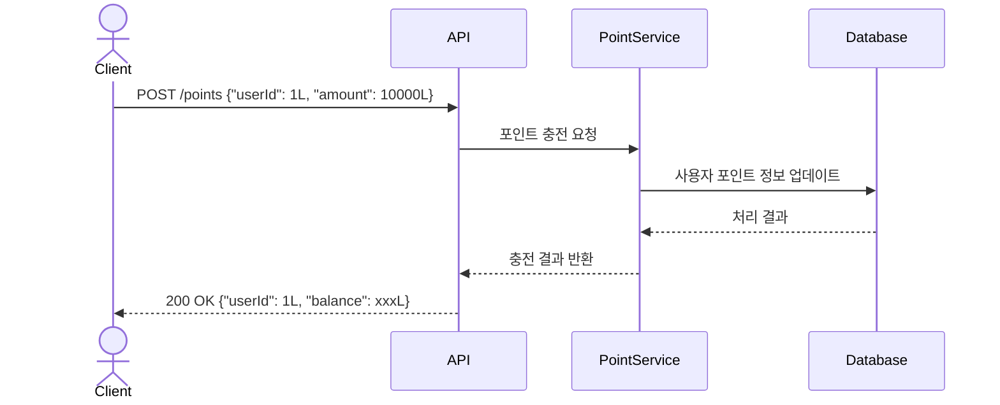
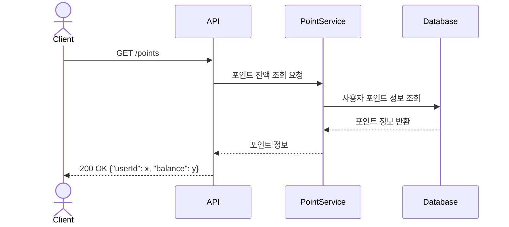
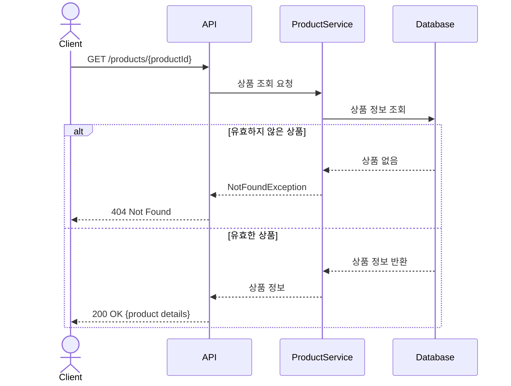
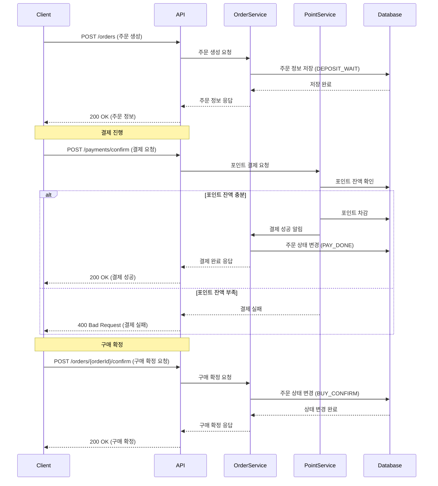
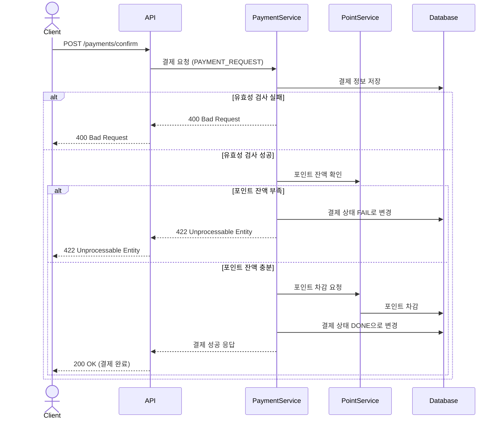
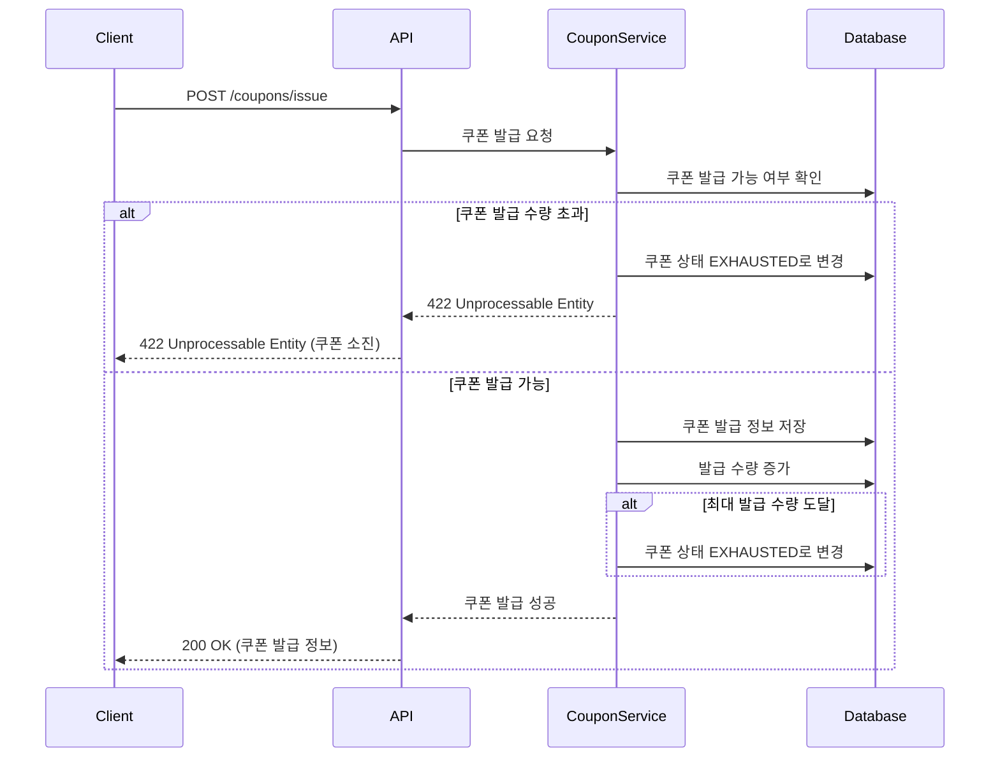
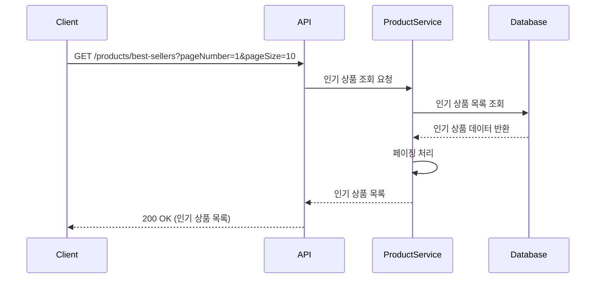
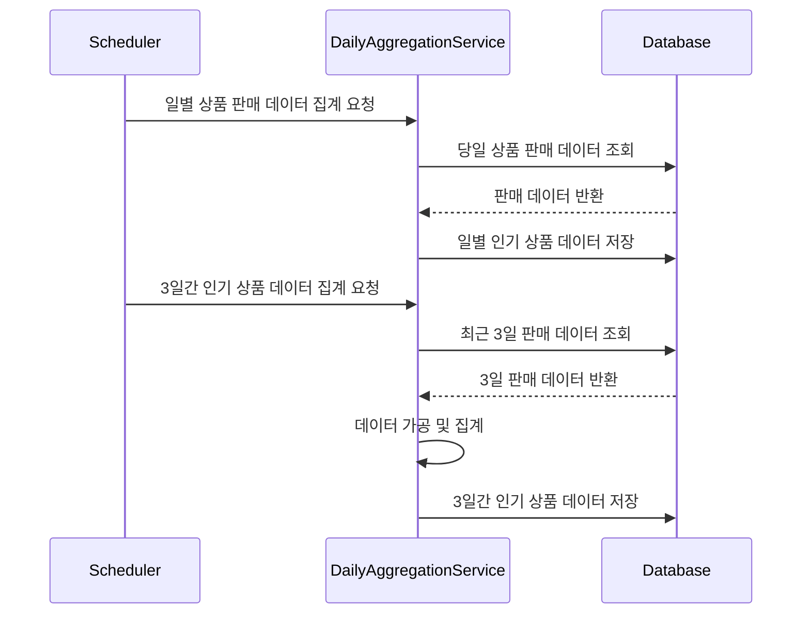

##  Sequence Diagram
### 1. 잔액 충전 API

### 2. 잔액 조회 API

### 상품 조회 API

### 주문 생성 API
1. 사용자가 주문 API를 통해 주문을 생성하면 주문 상태는 **"입금 대기(DEPOSIT_WAIT)"** 가 됩니다.
2. 사용자가 결제 API에 결제를 요청하면:
    - 포인트 시스템을 통해 사용자의 포인트 잔액을 확인합니다.
    - 잔액이 충분하면 포인트를 차감하고 주문 상태를 **"결제 완료(PAY_DONE)"** 로 변경합니다.
    - 잔액이 부족하면 결제가 실패합니다

3. 마지막으로 사용자가 구매 확정을 요청하면 주문 상태는 **"구매 확정(BUY_CONFIRM)"** 으로 변경됩니다.

### 결제 API

### 선착순 쿠폰 발급 API

### 인기 판매 상품 조회 API

