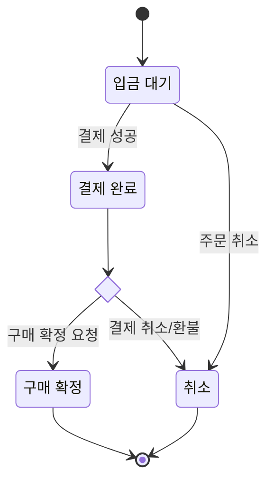
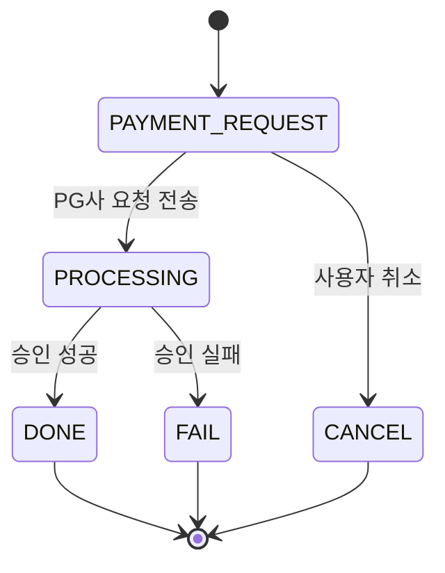
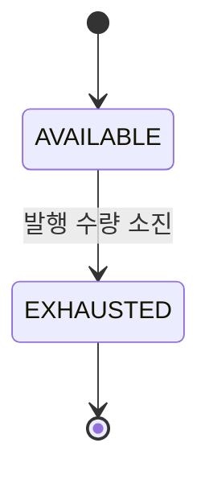

## 상태 다이어그램

### 주문 상태 다이어그램
**주문 상태** 는 `deposit_wait` (입금 대기), `pay_done` (결제 완료), `buy_confirm` (구매 확정), `pay-cancel`(결제 취소) 로 이루어집니다.  

### 결제 상태 다이어그램 
결제 상태는 `PAYMENT_REQUEST`(결제 요청), `DONE` (결제완료), `CANCEL` (결제 취소), `FAIL` (결제 실패) 

1. 결제 요청(`PAYMENT_REQUEST`) 상태에서 시작
   - 또는 사용자가 결제를 취소하면 취소(`CANCEL`) 상태로 전환
   - 처리 중 상태에서는 승인 결과에 따라:  
      - 승인 성공 시 결제 완료(`DONE`) 상태로 전환
      - 승인 실패 시 결제 실패(`FAIL`) 상태로 전환

### 쿠폰 상태 다이어그램
쿠폰 상태는 크게 `AVAILABLE` (발급 가능), `EXHAUSTED` (소진 완료) 구성됩니다.  

- `AVAILABLE` (발급 가능): 쿠폰이 등록되어 사용자가 발급받을 수 있는 상태
- `EXHAUSTED` (소진 완료): 발행할 수 있는 쿠폰이 모두 소진된 상태

